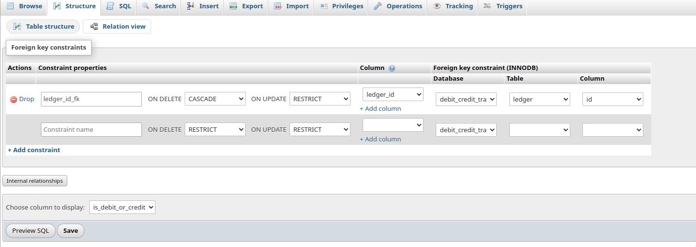

# Process of running this code

## 1) Install XAMPP and create a DB with necessary tables

`FOR WINDOWS`

- Download and install <b>XAMPP</b>
- Run the <b>mySQL</b> and <b>Apache</b> server
- Go to <b>localhost/phpmyadmin</b> and create a DB named `debit_credit_tracker`
- Create a table named `ledger` with 2 rows: <i><b>id</b></i> and <i><b>entity</b></i>
  </br></br>`Configuration For ledger:`</br>

  - Assign <u>BIGINT</u> to <i><b>id</b></i> and Auto Increment it.
  - Assign <u>VARCHAR</u> of length <u>255</u> to <i><b>entity</b></i>

- Create a table named `transaction` with 4 rows: <i><b>id</b></i>, <i><b>is_credit_or_debit</b></i>, <i><b>amount</b></i> and <i><b>ledger_id</b></b></i>
  </br></br>`Configuration For transaction:`</br>

  - Assign <u>BIGINT</u> to <i><b>id</b></i> and Auto Increment it.
  - Assign <u>ENUM</u> to <i><b>is_credit_or_debit</b></i> with values <u>CR</u> and <u>DR</u>
  - Assign <u>FLOAT</u> to <i><b>amount</b></i>
  - Link <i><b>id</b></i> from the `ledger` table to <i><b>ledger_id</b></i>
    </br>
    `Go to transaction>structure and configure it in a similar way:`
    

    </hr>
    </br>

`FOR LINUX (ARCH)`</br></hr>
Follow the same steps for linux, except the installation process. The installation process for linux is shown below.

<b>1) Switch to the directory where xampp is stored</b>

```
cd /media/downloads/linux/
```

<b>2) Get read/write permissions for the installer</b>

```
sudo chmod a+wr ./xampp-linux-x64-8.2.4-0-installer.run
```

<b>3) Run the installer as super user</b>

```
sudo ./xampp-linux-x64-8.2.4-0-installer.run
```

<b>4) Start the servers using either of the methods:</b>

```
sudo /opt/lampp/lampp start
```

<b>OR</b>

```
sudo /opt/lampp/lampp startapache
```

```
sudo /opt/lampp/lampp startmysql
```

</br>
</br>
</br>
<b>NOTE: IF THE ABOVE METHOD DOES NOT WORK / THROWS A `MISSING DEPENDENCY!` ERROR, DO THE FOLLOWING AND THEN START THE SERVERS AFTER RESTARTING YOUR SYSTEM.</b></br>

```
sudo pacman -S libxcrypt-compat
```

<b>AND</b>

```
sudo pacman -S net-tools
```

## 2) Create files and folders as required

Now, you need to go to `/opt/lampp/htdocs` for <b>linux</b> and `C:\xampp\htdocs` for <b>windows</b> and create the following folders and files:</br>

-
-
